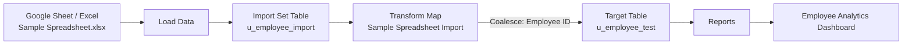

# Phase 3: Project Design

**Project:** Import Data using Transform Maps (Spreadsheet) – ServiceNow

## Team Details

| Name | Reg No | Department | College |
|------|--------|-----------|---------|
| Afrabanu S | C4S31901 | 3rd B.Sc Mathematics | Mary Matha College of Arts and Science |
| Kethrin Jenifer | C4S31902 | 3rd B.Sc Mathematics | Mary Matha College of Arts and Science |

---

## Data Flow Architecture

## Target Table Design – Employee Test (`u_employee_test`)

| Column Label | Type |
|--------------|------|
| Employee ID | String |
| Employee Name | String |
| Email | String |
| Department | String |
| Location | String |

*Employee Test table columns*

*Employee Test form layout*

## Field Mapping Design

| Source field (`u_employee_import`) | Target field (`u_employee_test`) | Coalesce |
|-----------------------------------|----------------------------------|----------|
| u_name | u_employee_name | false |
| u_employee_id | u_employee_id | **true** |
| u_department | u_department | false |
| u_location | u_location | false |
| u_email | u_email | false |

*Field maps created in the Transform Map*

## Report & Dashboard Design

| Report | Type | Group by | Aggregation |
|--------|------|----------|-------------|
| Employees by Department | Pie | Department | Count |
| Employees by Location | Bar | Location | Count |
| Employee List Report | List | Columns: ID, Name, Email, Department, Location | – |

All three reports are added to the **Employee Analytics Dashboard**.
