# Phase 4: Project Planning

**Project:** Import Data using Transform Maps (Spreadsheet) – ServiceNow

## Team Details

| Name | Reg No | Department | College |
|------|--------|-----------|---------|
| Afrabanu S | C4S31901 | 3rd B.Sc Mathematics | Mary Matha College of Arts and Science |
| Kethrin Jenifer | C4S31902 | 3rd B.Sc Mathematics | Mary Matha College of Arts and Science |

---

## Work Breakdown

| Phase | Activity | Deliverable |
|-------|----------|-------------|
| 1 | Prepare the sheets | `Sample Spreadsheet.xlsx` |
| 2 | Create custom table | `u_employee_test` with 5 fields |
| 3 | Import Set table (Load Data) | `u_employee_import` |
| 4 | Create Transform Map | Sample Spreadsheet Import |
| 5 | Transform data & validate | 15 records in Employee Test |
| 6 | Enable Coalesce | Employee ID coalesce = true |
| 7 | Insert new data (Excel) | 2 inserts, 2 updates verified |
| 8 | Create reports | 3 reports |
| 9 | Add reports to dashboard | Employee Analytics Dashboard |

## Milestones

```mermaid
gantt
    title Project Timeline (relative)
    dateFormat  X
    axisFormat  %s
    section Setup
    Prepare sheets & table      :0, 2
    section Import
    Load data & transform map   :2, 4
    Validate 15 records         :4, 5
    section Enhancement
    Coalesce & re-import test   :5, 7
    section Analytics
    Reports & dashboard         :7, 10
    section Closure
    Documentation & demo        :10, 12
```

## Risks and Mitigation

| Risk | Mitigation |
|------|------------|
| Duplicate records on re-import | Enable Coalesce on Employee ID |
| Wrong field mapping | Use Auto Map Matching Fields, then verify in Mapping Assist |
| Dashboard creation form not opening | Enable **Admin overrides** on the `pa_dashboards` create ACL |
| List columns in wrong order | Use Personalize List Columns |

## Team

| Name | Reg No |
|------|--------|
| Afrabanu S | C4S31901 |
| Kethrin Jenifer | C4S31902 |
