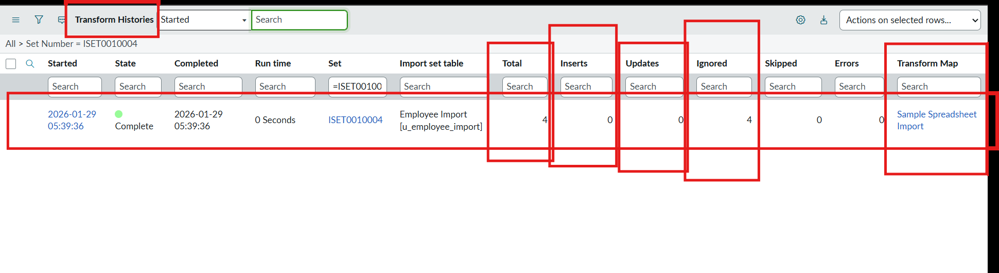

# Phase 8: Project Demonstration

**Project:** Import Data using Transform Maps (Spreadsheet) – ServiceNow

## Team Details

| Name | Reg No | Department | College |
|------|--------|-----------|---------|
| Afrabanu S | C4S31901 | 3rd B.Sc Mathematics | Mary Matha College of Arts and Science |
| Kethrin Jenifer | C4S31902 | 3rd B.Sc Mathematics | Mary Matha College of Arts and Science |

---

## Demo Flow

1. Show the source spreadsheet and the `.xlsx` download.
2. Show the **Employee Test** table and its fields.
3. Load data via **Load Data** → **Employee Import**.
4. Show the **Transform Map** and its field mappings.
5. Run the transform and open **Employee Tests** to show 15 records.
6. Show **Coalesce = true** on Employee ID.
7. Import the modified file and show **Transform History** (2 inserts, 2 updates).
8. Re-import the same file and show 0 inserts / 0 updates / 4 ignored.
9. Show the three reports and the **Employee Analytics Dashboard**.

## Demo Highlights

### Import and Transform

*Import set – Success*

*15 records imported into Employee Test*

### Coalesce in Action

*2 inserts and 2 updates*

*Updated records – SB-0004 renamed, SB-0010 email changed, 2 new employees*

*Identical re-import – 0 inserts, 0 updates, 4 ignored*

### Reports and Dashboard

*Employees by Department (Pie)*

*Employees by Location configuration (Bar)*

*Employee List Report*

*Employee Analytics Dashboard*

*Dashboard sharing by users, groups and roles*

## Demo Video
Google Drive link: [Project Demo Video](https://drive.google.com/file/d/1h7N6aCIalcucP7SH_ZIPwA-rWEZ-ESrn/view?usp=drivesdk)

GitHub Repository: [https://github.com/jkethrinjenifer/Import-Data-using-Transform-Maps-Spreadsheet-](https://github.com/jkethrinjenifer/Import-Data-using-Transform-Maps-Spreadsheet-)

## Final Result
All records were successfully imported into ServiceNow using Import Set and Transform Map, duplicates are avoided through Coalesce, and the data is presented through reports on a dashboard.
